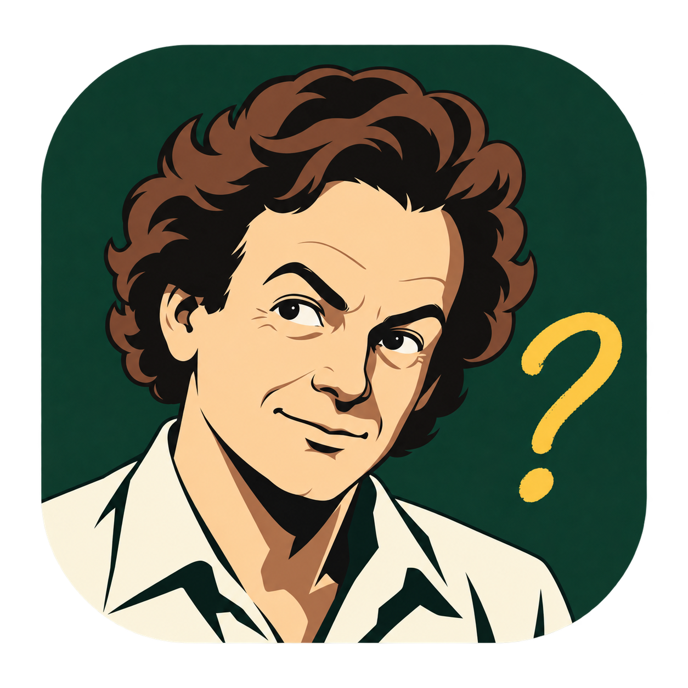
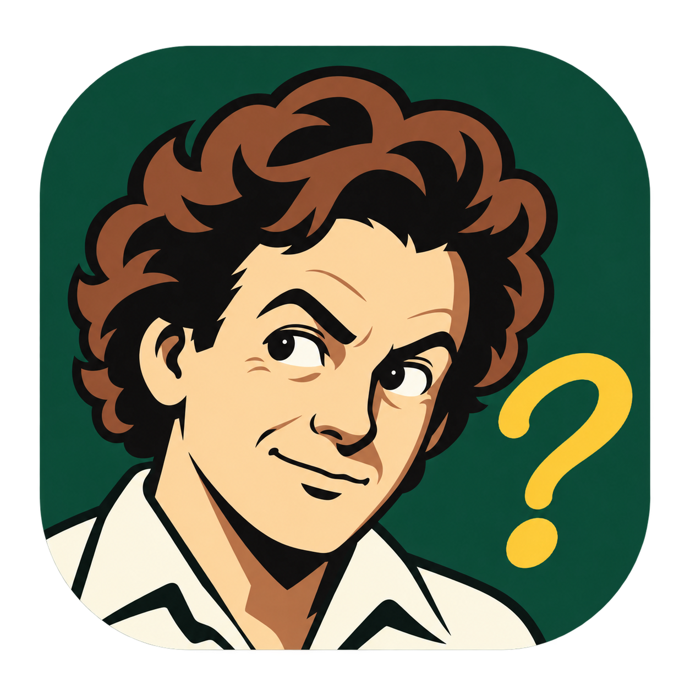
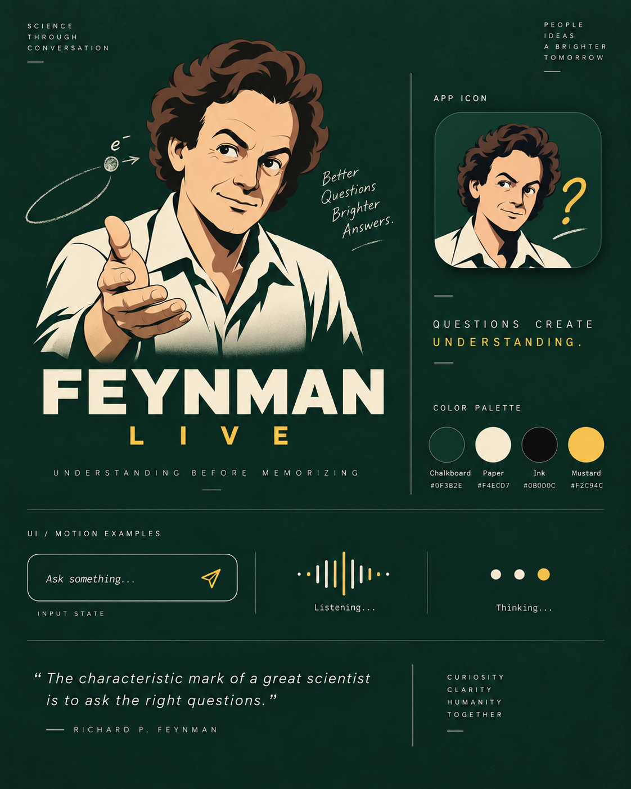
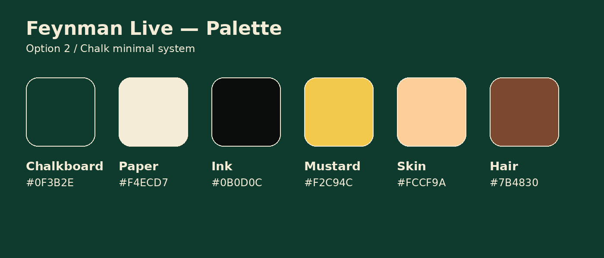
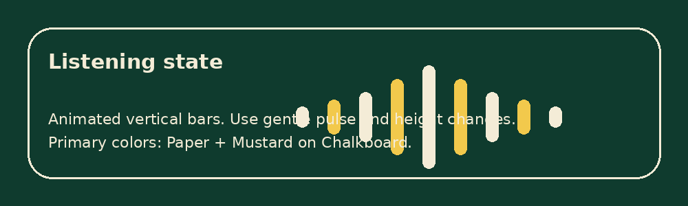
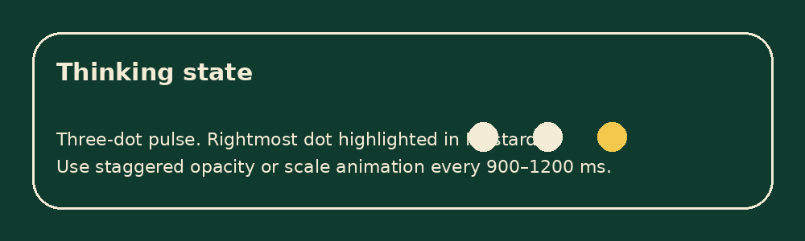
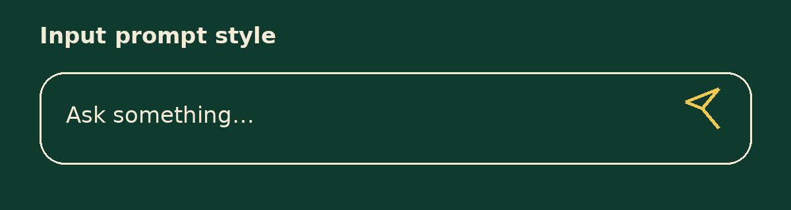

# Feynman Live — Brand Asset Pack (Option 2)

This pack focuses on **Option 2** from the selected direction: minimal chalk-style branding with a simplified Richard Feynman anime-inspired portrait, built for app/UI use.

## What is inside

- Isolated icon masters in two variants:
  - **Full icon**: for 64px and above.
  - **Micro icon**: simplified for favicon and Windows tray sizes.
- Exported PNG icons in all practical sizes.
- `favicon.ico` and `app.ico`.
- Image previews for palette and UI states.
- A JSON token file for implementation.

---

## Image references

### 1) Full icon master

### 2) Micro icon master (recommended for favicon and tray)

### 3) Selected style reference (Option 2 board)

---

## Recommended icon usage

- **16–48 px**: use the **micro icon**.
- **64 px and above**: use the **full icon**.
- Keep transparent padding outside the rounded-square shape.
- Do not place text inside the icon at small sizes.
- Avoid adding extra outlines, glows, or gradients that were not part of the source style.

---

## Delivered resolutions

| File | Size | Variant | Recommended use |
|---|---:|---|---|
| `favicon-16.png` | 16x16 | Micro | Browser favicon |
| `favicon-32.png` | 32x32 | Micro | Browser favicon / tabs |
| `favicon-48.png` | 48x48 | Micro | Legacy favicon / Windows shortcut |
| `tray-16.png` | 16x16 | Micro | Windows tray |
| `tray-20.png` | 20x20 | Micro | Windows tray @125% |
| `tray-24.png` | 24x24 | Micro | Windows tray @150% |
| `tray-32.png` | 32x32 | Micro | Windows tray / taskbar small |
| `icon-64.png` | 64x64 | Full | Small app icon |
| `icon-96.png` | 96x96 | Full | General UI |
| `icon-128.png` | 128x128 | Full | Desktop / shortcuts |
| `mstile-150x150.png` | 150x150 | Full | Windows tile |
| `apple-touch-icon.png` | 180x180 | Full | Apple touch icon |
| `android-chrome-192x192.png` | 192x192 | Full | Android / PWA |
| `icon-256.png` | 256x256 | Full | Desktop / store usage |
| `android-chrome-512x512.png` | 512x512 | Full | PWA / high-res app icon |
| `icon-1024.png` | 1024x1024 | Full | Master export |

Extra files:

- `./assets/icons/favicon/favicon.ico`
- `./assets/icons/windows/app.ico`

---

## Core palette

### Primary brand colors

| Token | Hex | Usage |
|---|---|---|
| `chalkboard` | `#0F3B2E` | Primary background, app surfaces, icon field |
| `paper` | `#F4ECD7` | Main foreground text, shirt/light surfaces |
| `ink` | `#0B0D0C` | Deep shadows, text on light backgrounds |
| `mustard` | `#F2C94C` | Accent, question mark, active status, focus detail |

### Supporting illustration colors

| Token | Hex | Usage |
|---|---|---|
| `skin` | `#FCCF9A` | Character skin tone |
| `hair` | `#7B4830` | Character hair midtone |
| `hair_shadow` | `#523425` | Character hair and facial shadow depth |
| `chalkboard_deep` | `#0E2C21` | Darker surface variant / hover / depth |

---

## Typography

The generated concept art does not encode an exact production font, so the implementation standard is:

- **Primary font**: `Space Grotesk`
- **Fallback / body font**: `Inter`
- **Optional monospace** (if needed for diagnostics or technical labels): `IBM Plex Mono`

### Recommended weights

- 400 regular
- 500 medium
- 600 semibold
- 700 bold

### Recommended usage

- **App name / strong headings**: Space Grotesk 700
- **Section labels / buttons**: Space Grotesk 600
- **Body text / helper text**: Inter 400–500
- **Small technical labels**: IBM Plex Mono 400–500 (optional)

If the implementation must use **only one font**, use **Space Grotesk** everywhere.

---

## UI state language

### Listening state

**Pattern**
- Vertical bar waveform.
- Symmetrical or near-symmetrical arrangement.
- Soft pulsing height animation.

**Colors**
- Background: `#0F3B2E`
- Bars: alternating `#F4ECD7` and `#F2C94C`

**Behavior**
- Use gentle height variation.
- Loop duration: **900–1200 ms**.
- Avoid hyperactive motion.

### Thinking state

**Pattern**
- Three dots.
- Rightmost or active dot highlighted in mustard.

**Colors**
- Background: `#0F3B2E`
- Inactive dots: `#F4ECD7`
- Active dot: `#F2C94C`

**Behavior**
- Sequential pulse, opacity shift, or slight scale-up.
- Loop duration: **900–1200 ms**.

### Input prompt style

**Pattern**
- Rounded rectangle input field.
- Paper text on chalkboard background.
- Mustard send/action icon.

---

## Visual style summary

- Minimalist educational/scientific brand.
- 1980s anime-inspired portrait style, but cleaned up into usable product identity.
- Chalkboard green as the base environment.
- Paper and mustard for readable, warm contrast.
- Human, curious, intelligent tone.
- The **question mark** is not decorative only; it is a core semantic symbol of curiosity and inquiry.

---

## Implementation notes for another AI or engineer

1. Use the **micro icon** for any tiny context where facial details can collapse.
2. Use the **full icon** from 64px upward.
3. Default dark theme should be built on `chalkboard` + `paper` + `mustard`.
4. Keep animations subtle and academic, not gaming-like or cyberpunk.
5. Keep rounded corners and simple line language consistent across components.
6. Preserve the overall tone: **curiosity, clarity, humanity**.

---

## File map

- `./assets/icons/master/` → source masters
- `./assets/icons/png/` → PNG exports by size
- `./assets/icons/favicon/` → favicon assets
- `./assets/icons/windows/` → Windows-specific assets
- `./assets/icons/apple/` → Apple touch icon
- `./assets/icons/android/` → Android / PWA icons
- `./assets/previews/` → preview blocks and style references
- `./docs/design-tokens.json` → machine-readable design tokens
